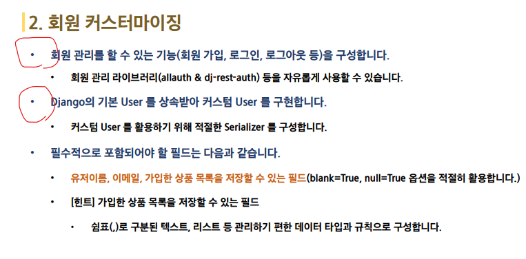
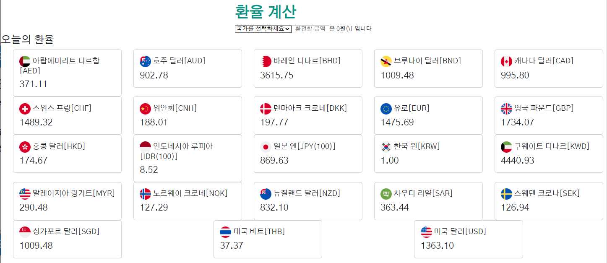
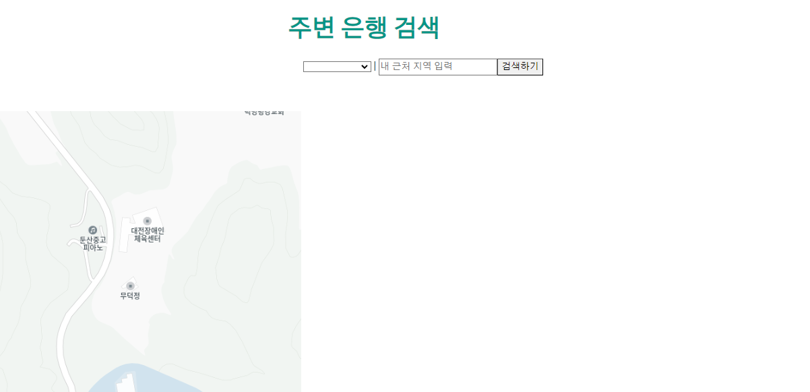
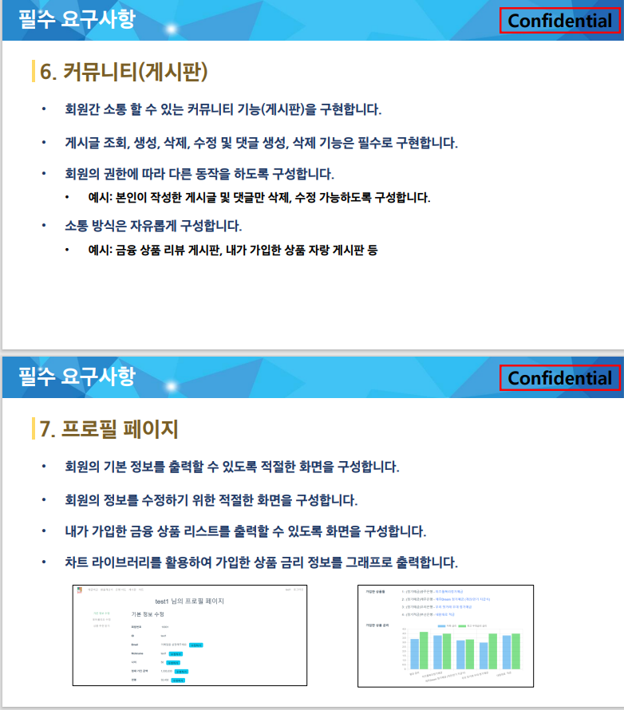

# 각티슈 뽑듯 간편한 금리 비교 사이트 INTERESTing✨

## 1. 팀원 정보 및 업무 분담 내역
### 구고운(팀장)
- PPT 발표
- 발표 자료 준비
- 회원가입, 로그인, 로그아웃, 프로필, 회원 정보 수정 기능 구현
- User 닉네임, 캐시 충전 기능 구현
- 커뮤니티 CRUD 구현
- 상품 가입 기능 구현
- 예금 API 연결
- 프로필, 커뮤니티, 메인 페이지, 내 근처 은행 찾기, 챗봇, 로그인, 회원가입, 환율 계산기, 주식 선물 CSS 디자인

### 홍성주
- 환율, 적금, 챗봇, 주식 API 연결
- 챗봇 추천 알고리즘 구현 
- 메인 페이지 CSS 디자인


## 2. 설계 내용 및 실제 구현 정도
### 프로젝트 배경
⚓ [KEY POINT 1] 
사람들은 금융 상품을 너무 어려워한다.
한국인은 미국인과 대비해 주식 투자를 하는 사람이 적은 편이다.
접근성이 좋은 금리 비교 사이트가 있다면 더욱 간편한 세상이 되지 않을까?

⚓ [KEY POINT 2]
누구나 쉽게 선물을 주고 받는 시대,
주식을 선물할 수는 없을까?

### INTERESTing
금리(Interest Rate)를 흥미롭게(Interesting) 이용하는(~ing) 소비자를 위한 플랫폼 INTERESTing!


### ♟️예상 Sequence Diagram (경로)
- 예적금 비교 Sequence Digram
  
  - (완료) 예적금 금리 비교 조회 구현
  - (완료) 예적금 상세 정보 구현
  - (미완료) 사용자 예산 변경에 따른 예상 이자 반환

- 주식 선물 Sequence Digram

  - (완료) 주식 선물 메인페이지 조회 시 주식 정보 반환
  - (미완료) 주식 선물 페이지 요청시 구매 가능 여부 판단

### 🛠️ 기능 명세서 (외부)


### 👀 API 명세서 (내부)


### 💝 기대 효과
- 고객: 각티슈 뽑듯이 편리하게 예적금 금리 비교, 주식 선물하기 가능
- 은행: 이벤트 페이지로 금융 상품 홍보 효과, 예적금 금리 리뷰(후기)로 우대 이율 이벤트 가능
- INTERESTing: 고객에게 경쟁력있는 금융 상품 추천 가능, 대한민국 국민에게 주식의 관심도 증가 기대

## 3. 데이터베이스 모델링(ERD)
- 구현 전 예상 ERD

- 수정 ERD


---
## 4. OpenAI 챗봇을 활용한 금융 상품 추천 알고리즘
### 기능
- 사용자에게 입력값 받으면 javascript의 axios를 통해 요청된 Django 내부로 연결
- django 내부 view에서는 사용자의 입력값이 다음과 같이 처리된다.
  1.  pymysql을 사용해 MYSQL 활용
  2-1. 예적금 상품 정보 중 [상품번호(fin_prdt_cd), 은행이름(kor_co_nm), 상품이름(fin_prdt_nm), 우대조건(spcl_cnd)]
  2-2. 예적금 옵션 정보 중 [상품번호(fin_prdt_cd), 기간(save_trm), 기본금리(intr_rate), 최대금리(intr_rate2)]
  3. 가져온 데이터를 json 데이터로 재가공한다.
  4. AI 역할 지정 및 if, elif, else문을 활용해 사용자의 질문에 적절히 답할 수 있도록 구성
- 처리된 후 추출된 AI의 답변은 다시 프론트로 보내 Vue에 출력됨

### 💻 챗봇 코드 구성(Django의 view)
- 역할 지정
챗봇의 역할 지정. INTERESTing이 어떤 사이트인지, 어떤 역할을 해야하는지 입력
  ```
  chat_history.extend(
        [
            {"role": "user", "content": f"{input_message}"},
            {"role": "system", "content": f"반드시 한글로 대답해줘. 너는 금리비교 사이트인 INTERESTing의 챗봇으로 사람들에게 추천 예적금을 알려줘야 해."}
        ] 
    )
    ```

- 필터링 및 프롬프트:
  1. ‘은행’과 ‘추천’을 같이 입력할 시 은행과 상품 추천을 함께, 추천이 아닌 은행만 물어본다면 은행 이름만 5개 추천하도록 구성
    - 코드
    ```
    if '은행' in input_message and '추천' in input_message:
        chat_history.append(
            {"role": "system", "content": f"만약 은행을 추천한다면 {product_info}에 기반해서 kor_co_nm와 fin_prdt_nm를 3개 추천해줘."}
        )
    elif '은행' in input_message:
        chat_history.append(
            {"role": "system", "content": f"만약 은행에 대해 물어보면 {product_info}의 kor_co_nm만 5개 정도 알려줘."}
        )
    ```
    - 은행 입력시 프롬프트
    

  2. ‘예금’과 ‘적금’을 같이 물어보면 3개 정도 추천, 예금과 적금 중 하나만 물어보았다면 해당 상품군 안에서만 3가지를 추천하도록 구성 
    - 코드
    ```
    if '예금' in input_message and  '적금' in input_message and '추천' in input_message:
        chat_history.append(
            {"role": "system", "content": f"만약 예금, 적금 상품을 추천한다면 {input_message}와 {product_info}의 spcl_cnd 정보에 기반해서 예금, 적금 상품을 합쳐서 3개 정도 추천해줘."}
        )
    elif '예금' in input_message and '추천' in input_message:
        chat_history.append(
            {"role": "system", "content": f"만약 예금 상품을 추천한다면 {input_message}와 {product_info}의 spcl_cnd 정보에 기반해서 예금 상품을 3개 정도 추천해줘. 적금은 추천해주면 안돼"}
        )
    elif '적금' in input_message and '추천' in input_message:
        chat_history.append(
            {"role": "system", "content": f"만약 적금 상품을 추천한다면 {input_message}와 {product_info}의 spcl_cnd 정보에 기반해서 적금 상품을 3개 정도 추천해줘. 예금은 추천해주면 안돼" }
        )
    ```
    - 예금, 적금 추천시 프롬프트
    
  3. 금리를 물어봤을때 아직 금융상품을 고르지 않았다면 상품명을 다시 물어보도록 구성
    ```
    if '금리' in input_message:
    chat_history.append(
        {"role": "system", "content": f"만약 금리를 물어봤는데 금융상품인 fin_prdt_nm를 선택 안했다면 어떤 상품으로 조회할지 먼저 물어봐 줘. fin_prdt_nm를 선택했다면 {deposit_info}에 기반해서 물어본 savings_info의 최저금리 intr_rate와 최고금리 intr_rate2를 알려줘."}
    )
    ```
    - 금리 입력시 프롬프트
    

- AI 추천 기술 구현:
  - 결혼, 청년, 학생 등 여러 조건을 가진 사용자를 조건문으로 나누기에는 오랜 시간이 소요된다.
  - 가장 AI가 효율적으로 판단하기 위한 방법을 고민했고, 우대조건 데이터를 불러오며 해결했다. 우대조건에는 여행적금 가입자, 에너지 절감, 청년 응원 우대 등 상품의 특징이 뭍어나 있어 AI의 효율적인 판단이 가능해졌다.

## 5. 서비스 대표 기능 설명
### 메인 페이지

- 예금, 적금 TOP3 상품 소개
  - 전체 예적금 데이터 중 최고금리가 가장 높은 금융 상품 노출
  - 가장 높은 금리 상품으로 가입할 시 받을 수 있는 이자 출력
  

### 회원 커스터마이징 (수정필요)
- allauth 회원 관리 라이브러리를 사용해 구성
- 필드 구성: 아이디, 닉네임, 이메일, 가입한 상품 목록
-
-



### 예적금 금리 비교
   **1. 데이터 저장**
  - 금융감독원의 금융상품비교공시 API를 활용해 예적금 데이터 저장
  - 상품에 정보가 없는 부분이 중간중간 있으니  model에서 black=True, null=True를 적절히 배치
  ```
  # models.py의 적금 옵션
  class OptionList(models.Model):
      financial_product = models.ForeignKey(FinancialProduct, related_name='options', on_delete=models.CASCADE)
      fin_prdt_cd = models.CharField(max_length=50)                       # 금융 상품 코드
      rsrv_type = models.CharField(max_length=1, null=True)               # 적립 유형
      rsrv_type_nm = models.CharField(max_length=20, null=True)           # 저축 유형명
      save_trm = models.CharField(max_length=3)                           # 저축 기간(개월)
      intr_rate = models.FloatField(blank=True, null=True)                # 저축금리
      intr_rate2 = models.FloatField(blank=True, null=True)               # 최고 우대금리
  ```
  - 이미 있는 데이터는 저장되지 않도록 view에서 처리
  ```
  # views.py에서 겹치는 필드 제외
          if FinancialProduct.objects.filter(fin_prdt_cd=li['fin_prdt_cd']).exists():
              continue
          product_serializer = SavingsProductsSerializer(data=save_data)
          # 유효성 검증
          if product_serializer.is_valid(raise_exception=True):
              # 유효하다면 저장
              product = product_serializer.save()
  ```
  **2. 전체 조회**
  
  - 예적금 상품에서 전체 기간 중 가장 최저 금리와 최대 금리로 출력되도록 구성
  - 그 중 최고금리를 기준으로 내림차순 정렬되도록 함


### 환율 계산기

- 한국수출입은행 환율정보 API를 활용해 환율 데이터 저장
- 국가를 선택해 원화로 환전시 얼마인지 제공
- input에 v-model을 연결해 환율 바로 출력되도록 함
```
<!-- template -->
<input type="text" v-model.number="amount" placeholder="환전할 금액">{{ selectedExchange?.cur_unit }}은 {{ calculateResult }}원(₩) 입니다

<!-- script -->
// 환율 계산 함수
const calculateResult = computed(() => {
    if (selectedExchange.value) {
        console.log(selectedExchange.value.id)
        const exchangeRate = (selectedExchange.value.id === 12 || selectedExchange.value.id === 13) ? parseFloat(selectedExchange.value.ttb) / 100 : parseFloat(selectedExchange.value.ttb)
        return Math.round(amount.value * exchangeRate)
    }
    return 0
})
```

### 근처 은행 검색

- 카카오맵 API를 활용해 지도 데이터 요청
- 은행과 근처 지역 입력값을 따로 받되, 검색시 내부에서는 이 두 값을 합쳐 API 요청

```
<!-- template -->
<div class="m-4">
    <select v-model="result" id="keyword" class="custom-border">
      <option value="" selected disabled>은행 선택</option>
      <option v-for="(bank, index) in banks" :key="index" :value="bank">
      {{ bank }}
      </option>
    </select>  |  
    <input type="text" id="region" size="20" placeholder="내 근처 지역 입력" class="custom-border" />
    <button @click="searchPlaces" class="custom-border">검색하기</button>
</div>
<!-- script -->
  const query = keyword + ' ' + region; // 지역 정보를 은행와 합침

  this.ps.keywordSearch(query, this.placesSearchCB.bind(this)); // 합친 쿼리로 검색 수행
```

### 주식 커뮤니티(게시판) (수정필요)

- 
- 

- 
- 

### 프로필 페이지  (수정필요)
-
-


## 6. 후기
### 고운
- 처음이자 마지막이 될 지도 모르는 Django를 이용한 백엔드 프로그래밍, 재미있었습니다. Django를 이용해 스스로 구현한 대부분의 페이지를 Vue를 이용해 보기 좋게 구현하면서 강의와 평가로는 미처 익히지 못했던 지식들을 보완할 수 있었습니다.
- 스스로 작성한 코드로 인해 발생한 오류를 스스로 고치고, 사이트가 생각했던 대로 작동했을 때 말로 표현하기 어려운 쾌감을 느꼈습니다. 멋진 개발자가 되고 싶다는 생각이 확확고해지는 프로젝트 기간이었습니다. 
- 시간이 삼 일만 더 주어졌다면 기능적으로도 미적으로도 만족할 만한 결과물을 낼 수 있었을 것이라는 아쉬움이 남습니다. 추후 개인적으로 완성시키고자 합니다.

### 성주
- 항상 API 연결에 대한 두려움이 있었는데 이번 기회에 계속 연습하며 프론트 Vue부터 백 Django까지, Django 부터 MYSQL까지 어떻게 연결이 되는지 이해하는 시간이 되었습니다.
- 특히 챗봇을 만드는 과정에서 뷰에서 받은 입력값에 MYSQL데이터를 참조할 수 있도록 AI를 훈련시키는 과정이 굉장히 흥미로웠습니다. pymysql이라는 좋은 패키지를 활용해 데이터를 db에 따로 저장하고, 이를 if문으로 간단하게 AI를 훈련시킬 수 있었습니다. 기회가 된다면 OpenAI API로 다른 추천 서비스도 구현하고 싶다는 목표가 생겼습니다.
- 여러 기능들을 일주일안에 구현하느라 완벽한 기능 구현과 시간 분배에 대한 아쉬움도 있지만 이번 프로젝트 경험을 밑거름 삼아 더 성장하는 개발자가 되겠습니다!


---
---

o(*￣▽￣*)ブ 3햄팟의 INTERESTing한 기록

240516

- 고운
  User 기능 구현: 로그인, 회원가입

- 성주
  카카오맵 API 연결

---

240517

- 고운
  User 기능 보완: 닉네임, 캐시 추가
  적금 API 연결
- 성주
  환율 API 연결

💞 240518

- 고운

1. profile 페이지에서 유저의 ID는 출력되나, 닉네임이 출력되지 않는 문제.
   유저의 개인정보 변경 기능을 구현하지 않았기 때문에 변경될 일이 없을 것이라는 판단 하에 authStore.user가 없을 때만 fetchUserDetails를 호출하도록 하였음.

- 수정 전 코드

```
onMounted(() => {
  if (!authStore.user) {
    authStore.fetchUserDetails();
  }
});
```

하지만 로그아웃 로직에 사용되는 유저 ID와는 다르게, 닉네임은 null값으로 초기화되는 로직을 작성하지 않았고, 수정 전 코드의 경우 컴포넌트가 마운트될 때 authStore.user가 null 또는 undefined일 경우에만 fetchUserDetails를 호출하도록 되어 있어 닉네임은 출력되지 않는 현상이 발생함.

- 수정 후 코드

```
onMounted(() => {
  authStore.fetchUserDetails();
});
```

if 조건문을 삭제하자 닉네임이 정상적으로 출력됨. 추후 개인정보 수정 기능을 구현할 예정이므로 불필요한 조건문이었던 것으로 보임.

- 성주
  적금 API연결, 환율 계산기 제작

1. 환율 api 데이터 vue에 출력하기 오류
   django의 exchange_rate의 views.py에서 data=rate는 객체를 생성해서 DB에 저장하거나 수정할때 사용하는 코드이다.

오류 코드

```
serializer = ExchangeSerializer(data=rate, many=True)
```

MYSQL문 수정은 가능하지만 Vue까지 도달하지 않는다

수정코드

```
serializer = ExchangeSerializer(rate, many=True)
```

이렇게 'data=' 구문을 빼주면 DB의 쿼리셋을 불러와서 json 형태로 바꿔지고 Vue까지 도달해 출력이 잘 된다.

2. API 연결해서 Vue까지 출력하는 방법
   api를 받을 app 생성 => django 경로를 연결한다(urls.py) => views.py에 api 연결 루트를 작성하고 models.py와 serializers.py에 저장하고 싶은 데이터를 작성한다 => Vue의 component에 axios로 django 경로를 요청한다 => 사이트에서 get 요청이 들어오면 Vue에 데이터가 잘 출력된다.


240519
- 성주: 챗봇 API 연결
1. OpenAI API를 활용해 연결했다. 연결이 어려울 줄 알았지만 javascript 코드와 html만 있으면 API키를 작성해 쉽게 연결 가능하다.

240520
- 성주: 예적금 원하는 값만 출력
예적금의 여러 옵션 상품 중 가장 최저 금리, 최고 금리만 출력되도록 구성하기 위해 for 문을 사용해 minRate 값으로 지정했다.
```
<!-- 가장 최소 금리 구하기 -->
const min_savings = (options) => {
  let minRate = Number.POSITIVE_INFINITY
  for (const option of options) {
    minRate = Math.min(minRate, option.intr_rate)
    minRate = Math.min(minRate, option.intr_rate2)
  }
  return minRate
}
```
for문으로 option을 돌며 가장 작은 금리 minRate를 추출한다. 


240521
- 성주: 주식 API 연결
기존에 있는 공공데이터, 또는 한국투자증권같은 주식 API는 데이터 종류가 많아 값을 추출하기 어려웠다. 그렇게 알아낸게 기존 네이버 증권 API이다. 원하는 데이터가 있는 사이트의 개발자 칸으로 들어가 json 형식으로 출력되는 데이터를 찾아낸다.
```
def popular(request):
    response = requests.get(BASE_URL).json()
    stocks = response.get('datas', [])

    for li in stocks:
        itemCode = li['itemCode']
        stockName = li['stockName']
        closePrice = li['closePrice']
        compareToPreviousClosePrice = li['compareToPreviousClosePrice']
        code = li['compareToPreviousPrice']['code']
        text = li['compareToPreviousPrice']['text']
```
추출한 BASE_URL만 가져오면 데이터롤 저장하는 과정은 동일하다.

20240522
- 성주: 챗봇 제작
질문을 모두 자연스럽게 대답하도록 구성하고 싶었고, 우대금리 혜택 리스트 데이터를 가져와 해결했다.
```
<!-- 챗봇 역할 지정 -->
    chat_history.extend(
        [
            {"role": "user", "content": f"{input_message}"},
            {"role": "system", "content": f"반드시 한글로 대답해줘. 너는 금리비교 사이트인 INTERESTing의 챗봇으로 사람들에게 추천 예적금을 알려줘야 해."}
        ] 
    )

  <!-- 예적금 상품 추천 -->
    if '예금' in input_message and  '적금' in input_message and '추천' in input_message:
        chat_history.append(
            {"role": "system", "content": f"만약 예금, 적금 상품을 추천한다면 {input_message}와 {product_info}의 spcl_cnd 정보에 기반해서 예금, 적금 상품을 합쳐서 3개 정도 추천해줘."}
        )
    elif '예금' in input_message and '추천' in input_message:
        chat_history.append(
            {"role": "system", "content": f"만약 예금 상품을 추천한다면 {input_message}와 {product_info}의 spcl_cnd 정보에 기반해서 예금 상품을 3개 정도 추천해줘. 적금은 추천해주면 안돼"}
        )
    elif '적금' in input_message and '추천' in input_message:
        chat_history.append(
            {"role": "system", "content": f"만약 적금 상품을 추천한다면 {input_message}와 {product_info}의 spcl_cnd 정보에 기반해서 적금 상품을 3개 정도 추천해줘. 예금은 추천해주면 안돼" }
        )
```


